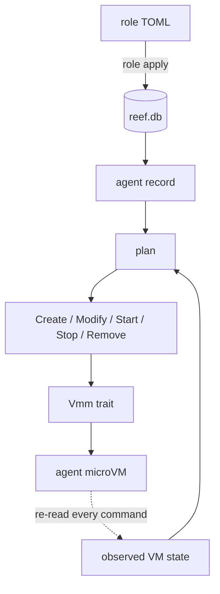

# reef architecture

Read this first; [README.md](README.md) covers usage. Keep both true: a sentence
the code does not back gets deleted, not softened.

## Goal

reef lets an organization run AI agents on its own hardware, safely. A platform
team declares agent **roles** as reviewable TOML files; developers create
**agents** from those roles without a ticket; every agent runs isolated in its
own [microsandbox](https://github.com/superradcompany/microsandbox) microVM
with deny-by-default egress and secrets it can spend but never read.

The bet: what an org actually needs from an agent host is not orchestration —
it is **containment it can review**. A role file is the whole blast radius:
the egress list is what the agent can reach, and each secret names the one
host it may be spent against. A reviewer reads ten lines and signs off once;
every instance inherits the policy.

## The model

The **agent record is durable; the VM is cattle.** An `Agent` is a spec
(owner, pinned role version, desired state) plus a status only the
reconciler writes. Every mutating CLI command runs one reconcile pass that
drives the VM toward the record, then returns. There is no daemon: VMs are
created detached, outlive reef, and are re-discovered by name on the next
command.



Invariants:

- Stop/start never destroys a VM. Only a role change recreates one; an env
  change is applied to the existing VM and takes effect on a restart, so the
  rootfs survives it.
- A volume declared by a role survives everything the VM does not: stop/start,
  the recreate a role change forces, and `agent rm`.
- A secret value never enters the guest (placeholder + host-side TLS
  substitution, bound to one host) and never enters reef's database, events,
  or errors (`Secret` has no `Serialize`; `Debug` redacts).
- Egress is deny-by-default, enforced at DNS; the role's domain list is the
  entire policy for the internet. A role opts out with the single rule `"*"`,
  which must stand alone and which `role apply` warns about; a secret's host
  binding still holds, so an unrestricted role spends secrets without reading
  them.
- The reef host is never a destination. Every role denies the host and
  loopback groups, so no agent reaches the host or another agent's published
  port, whatever its egress list says. DNS is the one exception, because the
  guest's resolver is the sandbox gateway.
- Drift is explicit: `generation != applied_generation` is visible in
  `agent list`, and every spec write is a compare-and-swap on `generation` —
  a lost race is a 409-style error, never a merge.
- A role's `[files]` seed the rootfs before start: the image is the base, the
  role's copy wins, and a path a volume would mount over is a parse error.
  Content is role data, not a secret channel.
- reef refuses to destroy a sandbox it did not create (a `reef.state` label
  carries the state dir's identity).
- `fleet apply` removes nothing without `--prune`, and prunes only agents it
  created; a hand-made agent is never adopted or removed by a fleet file.

## Layout

```
crates/reef-core   domain types, role parsing, plan()     deps: serde, toml (no I/O)
crates/reef        the binary: CLI, store, secrets, msb,  deps: reef-core, rusqlite,
                   console                                microsandbox, tokio, clap,
                                                          ratatui
```

The split is compiler-enforced: decision logic cannot touch I/O.

Flow: `role apply` parses and validates a role (line-and-column errors, all
problems at once), stores it content-addressed by digest, and marks it active.
`agent create` writes the record, then reconciles: the pure function
`plan(Facts) -> &[Action]` decides Create/Modify/Start/Stop/Remove from three
inputs (desired state, what drifted, observed VM), and the executor applies
each action through the six-method `Vmm` trait. `msb.rs` is the only module
that names a microsandbox type — the blast door for a pre-1.0 dependency
pinned at `=0.6.15` (upgrades are a deliberate task gated on the real-VM smoke
test, never a routine bump).

Console: `ui.rs` is a client of the `--json` rows the CLI prints, nothing more.
It fetches them by running this binary locally or `ssh ALIAS <reef> agent list
--json` remotely, polls every five seconds, and runs the same `agent start`,
`stop`, `update` and `rm` commands an operator would type. It never opens the
store and names no runtime type; a host knows only its own agents, and the
console merges independent hosts on the laptop. Cells carry a `Tone`, not a
`Style`: the render pass resolves it against one bool, so `NO_COLOR` needs no
second path and the palette stays named ANSI for the terminal's own theme to
shade.

State: reef's SQLite (`reef.db`, WAL) holds desired state plus last-applied
status and an append-only event log. Observed VM state is never cached — it is
re-read from the runtime on every command. microsandbox's own state under
`~/.microsandbox` is treated as the runtime's property; reef never parses its
files itself, reaching it only through the SDK, and doctor only checks the
directory's mode.

Secrets: roles hold `reef://store/name` references (a pasted literal is a
parse error). Values resolve host-side at VM create from `secrets.toml` —
an inline 0600 table, or a `[resolvers]` command template (`op read …`,
`bao kv get …`, `aws secretsmanager …`) whose stdout is the value. The
resolver seam is how reef plugs into whatever store the org already runs;
reef holds no credential for the credential store.

## Philosophy

- Least code that does the job. Fewer features over more. One mechanism per
  job. No speculative abstraction: the `Vmm` trait is the single deliberate
  exception, and it holds only the six methods the reconciler drives —
  operator commands (`ssh`, `exec`, `listening`, `forward`) live on the
  adapter itself.
- Data structures first; illegal states unrepresentable (`Failed` cannot lack
  a reason; invalid names do not construct).
- No inline comments — the code carries its meaning; clap doc-comments are
  help text and stay. No dead code, no field nothing reads, no config nothing
  honors, no doc sentence the code does not back.
- Every feature lands complete — type, plan, store, CLI, test — or not at all.
  Nothing additional gets built without the owner's explicit go-ahead.
- Verify on real hardware: `cargo test -p reef -- --ignored` boots an actual
  microVM and runs the whole journey.

## Deliberately absent

HTTP API and auth (the CLI is a local tool; the API will not ship without
auth), budgets and metering, teams and projects, a web UI, multi-host state
(each host's `reef.db` stands alone; `reef ui` fans out over ssh and merges
nothing on the hosts),
encrypted secrets at rest, lossless in-place image upgrade. Known limit: secret
values also persist in microsandbox's sandbox config until the VM is
recreated; removing that copy (env-source injection) is designed and queued.
Each returns only as a complete, owner-approved slice.
