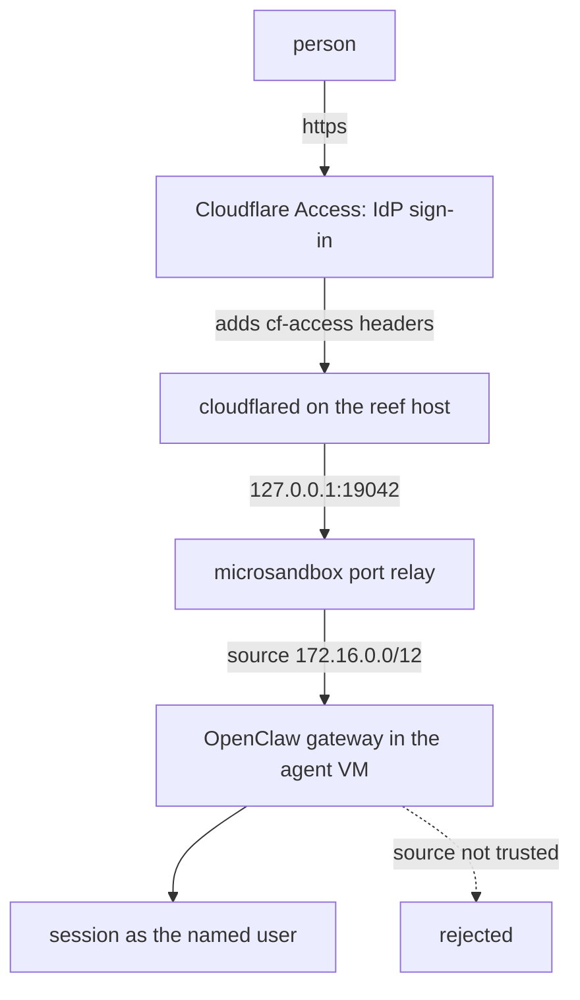

# Cloudflare Access

Put a shared agent behind the org's SSO. No inbound port, no public IP:
`cloudflared` runs on the reef host and dials out, Access authenticates every
request, and OpenClaw reads the identity Access injects.

**This is one worked example, not the only shape.** What reef and OpenClaw
actually need is a proxy that terminates your SSO, injects the caller's identity
as a header, and is the only thing that can reach the agent's port. oauth2-proxy,
Tailscale, or an ingress you already run all satisfy that; only `userHeader`
changes. Cloudflare is written up here because it needs no inbound port and no
public IP, which suits a host under someone's desk as well as a rack.



```text
Give this to your agent:

Put two reef agents behind Cloudflare Access by following
https://reef.clawbits.ai/docs/enterprise/cloudflare-access.md, with
https://reef.clawbits.ai/docs/setup/host.md for the host itself.
Create the Access applications before routing any DNS. Never turn on the
account-wide "Block traffic to all domains in this account" without telling me
what else that account serves. Show me each command's output before the next
step, and stop if an agent's published port is not the one it is serving.
```

## The one thing to get right

**Identity is a header, not a signature.** OpenClaw does not verify the Access
JWT. It admits a request when four things hold: the source address is in
`gateway.trustedProxies`, that address is neither loopback nor one of the guest's
own interfaces, the configured headers are present, and `X-Forwarded-For`
resolves to a client that is neither loopback nor itself a trusted proxy. A
request carrying an `Origin` header must also match
`gateway.controlUi.allowedOrigins`.

So the boundary is that **only `cloudflared` can reach the agent's port**. reef
gets you most of the way: published ports bind to host loopback, and every role
is denied the host and loopback groups whatever its egress list says, so one
agent cannot reach another's port. What is left is the host itself, which is why
`cloudflared` gets its own account below.

`trustedProxies` is `172.16.0.0/12` because reef's relay re-injects each
connection with the sandbox gateway as the peer; the guest never sees
`127.0.0.1`. The agent cannot mint an identity through that opening even though
its own address is inside the range: OpenClaw rejects any peer that matches one
of the guest's own interfaces.

`originRequest.access` narrows it further, by making `cloudflared` verify the
JWT's signature and audience before proxying. Per hostname, so one agent's token
cannot open another's.

## Set up

Get the seeded config right **before** first boot. `[files]` writes
`/etc/openclaw/defaults.json` into the rootfs, and the role's `start` script
copies it to the volume only when absent, so a later role edit reaches neither.
The public hostname is the exception: both roles read it from
`OPENCLAW_PUBLIC_HOST`, which OpenClaw resolves from the environment on every
config read, so changing it is `reef fleet apply` rather than a re-seed.

**1. The agents.** Put your hostnames in
[`fleet/openclaw-team.toml`](../../fleet/openclaw-team.toml) and your own domains
in the two role files. Keep hostnames **one level deep**
(`marketing.example.com`, not `marketing.agents.example.com`): Universal SSL
covers the apex and first-level subdomains only, and anything deeper fails TLS at
the edge before Access is reached unless the zone has Total TLS or an advanced
certificate.

```sh
reef role apply roles/openclaw-marketing.toml roles/openclaw-coding.toml
reef fleet apply fleet/openclaw-team.toml
reef agent get marketing
```

Use `fleet apply`, not `agent create`: a hand-made agent is not fleet-managed, and
a later `fleet apply` of the same name reports it and exits nonzero rather than
adopting it.

Note each `ports` line. That port is allocated at create and kept for the agent's
life, which is what makes it safe to name in the tunnel config. `agent rm` and
`fleet apply --prune` release it and a re-created agent takes the lowest free
port, so re-read `agent get` after either.

**2. Access applications, before any DNS.** An Access application can name a
hostname that does not resolve yet, and doing it in this order leaves no window
where the agent answers without a policy. Follow Cloudflare's
[self-hosted application guide](https://developers.cloudflare.com/cloudflare-one/access-controls/applications/http-apps/self-hosted-public-app/),
one application per hostname with one Allow policy each, and select only your own
identity provider so the default Cloudflare one cannot satisfy the login. For
GitHub, Cloudflare's
[GitHub IdP guide](https://developers.cloudflare.com/cloudflare-one/integrations/identity-providers/github/)
is the setup; own the OAuth app from the organization rather than a personal
account, or the consent screen names a person while asking for org access.

Copy each application's **AUD tag**. Do not turn on the account-wide *Block
traffic to all domains in this account*: it refuses every proxied hostname in
every zone of the account that has no Access application, which is right for an
account dedicated to agents and an outage for one that also serves your websites.

**3. The tunnel.** Create it with Cloudflare's
[locally-managed tunnel guide](https://developers.cloudflare.com/cloudflare-one/networks/connectors/cloudflare-tunnel/do-more-with-tunnels/local-management/create-local-tunnel/).
That flow is deliberate: the ingress rules and the Access binding stay in a file a
reviewer can read and a repo can hold. The reef-specific part is the mapping,
one rule per agent, each naming its own application:

```yaml
tunnel: <uuid>
credentials-file: /etc/cloudflared-reef/<uuid>.json
ingress:
  - hostname: marketing.example.com
    service: http://127.0.0.1:19042
    originRequest:
      access: { required: true, teamName: <team>, audTag: [<marketing aud>] }
  - hostname: coding.example.com
    service: http://127.0.0.1:19043
    originRequest:
      access: { required: true, teamName: <team>, audTag: [<coding aud>] }
  - service: http_status:404
```

`cloudflared` requires the last rule to match everything. Validate before running
anything: `cloudflared --config <file> tunnel ingress validate`.

Run it as its own unprivileged account, whose only reason to exist is being the
one thing that can reach those ports. `cloudflared service install` writes a unit
with no `User=`, so it runs as root and adds a daily self-update timer; and if a
tunnel already runs on this host it would replace that unit. Write your own:

```sh
sudo useradd --system --no-create-home --shell /usr/sbin/nologin cloudflared
sudo install -d -o cloudflared -g cloudflared -m 0750 /etc/cloudflared-reef
sudo install -o cloudflared -g cloudflared -m 0400 ~/.cloudflared/<uuid>.json /etc/cloudflared-reef/
```

with a unit running `cloudflared --no-autoupdate --config /etc/cloudflared-reef/config.yml tunnel run`
as `User=cloudflared`. Keep `cert.pem` in your own home: it can create tunnels and
edit zone DNS, and a running tunnel needs only the per-tunnel JSON.

**4. DNS last**, once the connector reports registered connections:

```sh
cloudflared tunnel route dns <tunnel> marketing.example.com
```

## Verify

Who got in, read from the agent:

```sh
msb logs reef-marketing --source system | grep 'authenticated user connected'
```

One line per authenticated connection, naming the email Access supplied.
`--source system` is required: reef boots the VM through the role's `init`, so
the gateway's output is a runtime diagnostic rather than captured exec output. A
separate line, `trusted-proxy browser device auto-approved`, is written once per
browser device on first approval.

If trusted-proxy supplies no identity the connection is refused, 401 on HTTP or a
WebSocket close 1008, with `reason=trusted_proxy_user_missing` in the log.
Nothing else admits it.

That nothing gets in without Access, run from a machine that is **not** the reef
host:

```sh
curl -sS -o /dev/null -w '%{http_code}\n' https://marketing.example.com/
```

A redirect or a 401 is the pass. A 200 means the request reached the agent with
Access not in front of it. The test has to run off-host because the boundary is
host-local: any process that can reach `127.0.0.1:<port>` arrives at the guest
from the sandbox gateway address and can set both headers itself. That is also
how you exercise the chain locally before Cloudflare exists:

```sh
curl -s -H 'X-Forwarded-For: 203.0.113.10' \
     -H 'cf-access-authenticated-user-email: you@example.com' \
     http://127.0.0.1:19042/readyz
```

There is no unauthenticated health endpoint on a trusted-proxy gateway, so a bare
`/readyz` returning 403 `proxy_attribution_required` is correct, not a fault.

## Notes

- **No `OPENCLAW_GATEWAY_TOKEN`.** trusted-proxy and token auth are mutually
  exclusive, and `--bind lan` accepts no token under trusted-proxy.
- **`requiredHeaders` is deliberately absent.** `cf-access-jwt-assertion` there,
  next to the Access email as `userHeader`, is the exact pair that switches
  OpenClaw onto a Cloudflare Access identity lookup reaching
  `*.cloudflareaccess.com` and `api.github.com`, which succeeds only for a
  GitHub-backed Access IdP. Without the pair, OpenClaw builds a durable user
  profile from the email alone, with no egress and no IdP coupling. OpenClaw only
  checks a required header is present, never that it is valid, which is what
  `originRequest.access` is for.
- **`allowedOrigins` must name the public hostname**, scheme included, no port for
  443. It comes from `OPENCLAW_PUBLIC_HOST` on the fleet entry. A wrong value is
  not a startup error: the gateway seeds loopback origins, the page loads, and the
  Control UI websocket closes with `origin not allowed`.
- **If the UI loads but never connects**, run the tunnel with `--protocol http2`.
  `cloudflared` defaults to QUIC, which has been reported to drop the WebSocket
  upgrade header.
- **Browser only.** Access covers every route on the hostname, so the CLI, TUI and
  paired nodes are blocked at the upgrade. `gateway.remote.edgeAuth` sends an
  Access service token, which gets past Access, but a service token carries no
  email and trusted-proxy then refuses it. Terminals are
  [remote access](/docs/enterprise/access).
- **Scopes are separate.** Who may open the agent is the Access policy; what they
  may do inside is [who can do what](/docs/enterprise/operators).
- **Everyone on the agent shares its state**: one session list, one workspace, one
  credential pool, one cookie jar. See
  [enterprise OpenClaw](/docs/enterprise/openclaw) for when to split.
