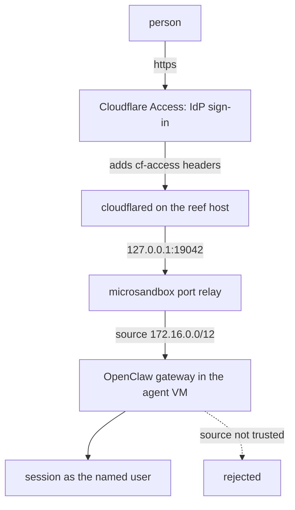

# Cloudflare Access

Put a shared agent behind the org's SSO. No inbound port, no public IP:
`cloudflared` runs on the reef host and dials out, Access authenticates every
request, and OpenClaw reads the identity Access injects.

One tunnel serves the fleet. Each agent gets a hostname, and the Access policy
on that hostname is who may use that agent.



## The one thing to get right

**Identity is a header, not a signature.** OpenClaw does not verify the Access
JWT. It admits a request when four things hold: the source address is in
`gateway.trustedProxies`, that address is neither loopback nor one of the
guest's own interfaces, the configured headers are present, and
`X-Forwarded-For` resolves to a client that is neither loopback nor itself a
trusted proxy. A request carrying an `Origin` header must also match
`gateway.controlUi.allowedOrigins`.

So the boundary is that **only `cloudflared` can reach the agent's port**. reef
gets you most of the way: published ports bind to host loopback, and every role
is denied the host and loopback groups whatever its egress list says, so one
agent cannot reach another's port. What is left is the host itself, which is
why `cloudflared` gets its own account below.

`trustedProxies` is `172.16.0.0/12` because reef's relay re-injects each
connection with the sandbox gateway as the peer; the guest never sees
`127.0.0.1`. The agent cannot mint an identity through that opening even though
its own address is inside the range: OpenClaw rejects any peer that matches one
of the guest's own interfaces.

`originRequest.access` below narrows it further. It makes `cloudflared` verify
the Access JWT's signature and audience before proxying, so a request that
reaches the connector without passing Access is dropped at the connector rather
than admitted by header presence.

## Set up

Get the seeded config right **before** first boot. `[files]` writes
`/etc/openclaw/defaults.json` into the rootfs, and the role's `start` script
copies it to `/home/node/.openclaw/openclaw.json` only when that file is
absent. That path is on the volume, so a later role edit reaches the rootfs and
not the live config.

The public hostname is the exception: both roles read it from
`OPENCLAW_PUBLIC_HOST`, which OpenClaw resolves from the process environment on
every config read. It is an agent env value, so changing it is
`reef fleet apply`, not a re-seed.

**1. The agents.** Edit
[`fleet/openclaw-team.toml`](../../fleet/openclaw-team.toml) and put your two
hostnames in `OPENCLAW_PUBLIC_HOST`. Keep them one level deep
(`marketing.example.com`, not `marketing.agents.example.com`): Cloudflare's
Universal SSL covers the apex and first-level subdomains only, and a deeper
hostname fails TLS at the edge before Access is reached unless the zone has
Total TLS or an advanced certificate. Then replace the placeholder egress
domains in
[`roles/openclaw-marketing.toml`](../../roles/openclaw-marketing.toml) and
[`roles/openclaw-coding.toml`](../../roles/openclaw-coding.toml) with your own.

```sh
reef role apply roles/openclaw-marketing.toml roles/openclaw-coding.toml
reef fleet apply fleet/openclaw-team.toml
reef agent get marketing
```

Use `fleet apply`, not `agent create`: an agent created by hand is not
fleet-managed, and a later `fleet apply` of the same name reports it and exits
nonzero rather than adopting it.

Note the `ports` line. That port is allocated at create and kept for the
agent's life, so it is safe to name in the tunnel config. `agent rm` and
`fleet apply --prune` release it and a re-created agent takes the lowest free
port, so re-read `agent get` after either.

To pick up an edited role: `reef role apply`, `reef agent update marketing`
(which recreates the VM with the new rootfs copy), then
`reef agent exec marketing -- rm /home/node/.openclaw/openclaw.json` and
`reef agent stop marketing && reef agent start marketing`. For a clean slate,
`reef agent rm marketing` plus `msb volume rm reef-vol-marketing-state`.

**2. The tunnel.** Needs your Cloudflare account; `tunnel login` opens a
browser against your zone.

```sh
cloudflared tunnel login
cloudflared tunnel create reef-agents
cloudflared tunnel route dns reef-agents marketing.example.com
cloudflared tunnel route dns reef-agents coding.example.com
```

Config, one ingress rule per agent, each naming its own Access application so
one agent's token cannot open another's hostname:

```yaml
tunnel: <uuid>
credentials-file: /etc/cloudflared/<uuid>.json
ingress:
  - hostname: marketing.example.com
    service: http://127.0.0.1:19042
    originRequest:
      access:
        required: true
        teamName: <your-team-name>
        audTag: [<marketing app aud>]
  - hostname: coding.example.com
    service: http://127.0.0.1:19043
    originRequest:
      access:
        required: true
        teamName: <your-team-name>
        audTag: [<coding app aud>]
  - service: http_status:404
```

`cloudflared` requires the last rule to match everything, and `404` is the
right terminal for a tunnel that only serves named agents.

Run it as its own unprivileged account, whose only reason to exist is being the
one thing that can reach those ports. `cloudflared service install` writes a
unit with no `User=`, so it runs as root and installs a daily self-update timer
unless you opt out:

```sh
sudo useradd --system --no-create-home --shell /usr/sbin/nologin cloudflared
sudo install -d -o cloudflared -g cloudflared -m 0750 /etc/cloudflared
sudo install -o cloudflared -g cloudflared -m 0400 ~/.cloudflared/<uuid>.json /etc/cloudflared/
sudo cloudflared --config /etc/cloudflared/config.yml service install --no-update-service
```

Then a drop-in at `/etc/systemd/system/cloudflared.service.d/override.conf`:

```ini
[Service]
User=cloudflared
Group=cloudflared
NoNewPrivileges=true
ProtectSystem=strict
ProtectHome=true
PrivateTmp=true
```

Keep `cert.pem` off the host. It is an account-wide credential that can create
and delete tunnels and edit zone DNS; a running tunnel needs only the
per-tunnel credentials JSON.

This is Cloudflare's locally-managed flow, which it now files under
**do more with tunnels > local management** rather than in Get started. It is
deliberate: the ingress rules and the Access binding stay in a file a reviewer
can read and a repo can hold.

**3. Access.** Turn on **Zero Trust > Access controls > Access settings >
Block traffic to all domains in this account** first, so a hostname with no
application is refused rather than exposed during the gap between routing DNS
and writing the policy.

Then, per hostname, **Zero Trust > Access controls > Applications > Create new
application > Self-hosted and private > Add public hostname**, with one Allow
policy naming the people or the IdP group. Copy each application's **AUD tag**
into the matching `audTag` above.

A new Zero Trust organization ships with the Cloudflare identity provider
enabled, which lets anyone with a Cloudflare account satisfy the login step
before the policy is evaluated. If the point is to prove the org's SSO, leave
only your own provider selected on the application. GitHub is the cheapest real
one: an OAuth app at **Zero Trust > Integrations > Identity providers**, and
its org and team selectors then work in the Allow policy.

## Verify

Who got in, read from the agent. `--source system` is required: reef boots the
VM through the role's `init`, so the gateway's output is a runtime diagnostic
rather than the captured output of a primary exec session.

```sh
msb logs reef-marketing --source system | grep 'authenticated user connected'
```

One line per authenticated connection, naming the email Access supplied. A
separate line, `trusted-proxy browser device auto-approved`, is written once per
browser device when that device is first approved, so a returning person shows
only the first line.

If trusted-proxy supplies no identity the connection is refused: 401 on HTTP,
or a WebSocket close 1008, with `reason=trusted_proxy_user_missing` in the
gateway log. Nothing else admits it.

That nothing gets in without Access, run from a machine that is not the reef
host:

```sh
curl -sS -o /dev/null -w '%{http_code}\n' https://marketing.example.com/
```

Expect a non-200: a redirect to the Access login, or a `401` for a non-browser
client. A `200` means the request reached the agent with Access not in front of
it. The test has to run off-host because the boundary is host-local: any
process that can reach `127.0.0.1:<port>` arrives at the guest from the sandbox
gateway address and can set both headers itself.

## Notes

- **No `OPENCLAW_GATEWAY_TOKEN`.** trusted-proxy and token auth are mutually
  exclusive; setting both is a startup error. `--bind lan` accepts no token
  under trusted-proxy. The fleet entries carry no token, unlike the single-user
  [openclaw](/docs/agents/openclaw) role.
- **`requiredHeaders` is deliberately absent.** `cf-access-jwt-assertion` there,
  alongside `cf-access-authenticated-user-email` as the `userHeader`, is the
  exact pair that switches OpenClaw onto a Cloudflare Access identity lookup
  that reaches `*.cloudflareaccess.com` and `api.github.com` and succeeds only
  for a GitHub-backed Access IdP. Without the pair, OpenClaw builds a durable
  user profile from the email alone, with no egress and no IdP coupling.
  OpenClaw only checks that a `requiredHeaders` entry is present; it never
  verifies the assertion, which is what `originRequest.access` is for.
- **`deviceAutoApprove` is required, not a convenience.** A trusted-proxy
  Control UI session with no paired device is admitted and then stripped of
  every scope, and it cannot approve its own pairing. Never put
  `operator.admin` in its scopes.
- **`allowedOrigins` must name the public hostname**, scheme included and no
  port for 443. It comes from `OPENCLAW_PUBLIC_HOST` on the agent's fleet
  entry. A missing or wrong value is not a startup error: the gateway seeds
  loopback origins, the page loads, and the Control UI WebSocket then closes
  with `origin not allowed`.
- **`allowUsers` is deliberately absent.** A user list in a seed-once config
  freezes at first boot, and matching is exact and case-sensitive against
  whatever the IdP emits. Let the Access policy be the list.
- **`tools.web.search` is off.** A declared `OPENROUTER_API_KEY` makes OpenClaw
  treat the perplexity web-search provider as configured, and that provider's
  plugin is not bundled, so startup refuses. The two roles turn the feature off
  rather than reach a plugin registry.
- **`NODE_EXTRA_CA_CERTS`** is in both roles because one secret turns on TLS
  interception for the whole VM, and OpenClaw only injects that variable for a
  version-manager Node. Without it the gateway's own outbound TLS, including
  the call to the model provider, rejects the interception certificate.
- **`browser.extraArgs`** is there for the same reason, and it costs more than
  it looks: inside the VM the browser then trusts any certificate. That is the
  price of keeping the provider key outside the guest.
- **A different proxy changes `userHeader`.** `trustedProxies` describes reef's
  relay, not the proxy. oauth2-proxy passes `x-auth-request-email`.
- **Browser only.** Access covers every route on the hostname, so the CLI, TUI
  and paired nodes are blocked at the WebSocket upgrade.
  `gateway.remote.edgeAuth` sends an Access service token, which gets a client
  past Access, but a service token carries no email and trusted-proxy auth then
  refuses it. Certificate-gated terminals are
  [remote access](/docs/enterprise/access).
- **If the UI loads but never connects**, run the tunnel with
  `--protocol http2`. `cloudflared` defaults to QUIC, which has been reported to
  drop the WebSocket upgrade header.
- **Everyone on the agent shares its state**: one session list, one workspace,
  one credential pool, one cookie jar. See
  [enterprise OpenClaw](/docs/enterprise/openclaw) for when to split.
