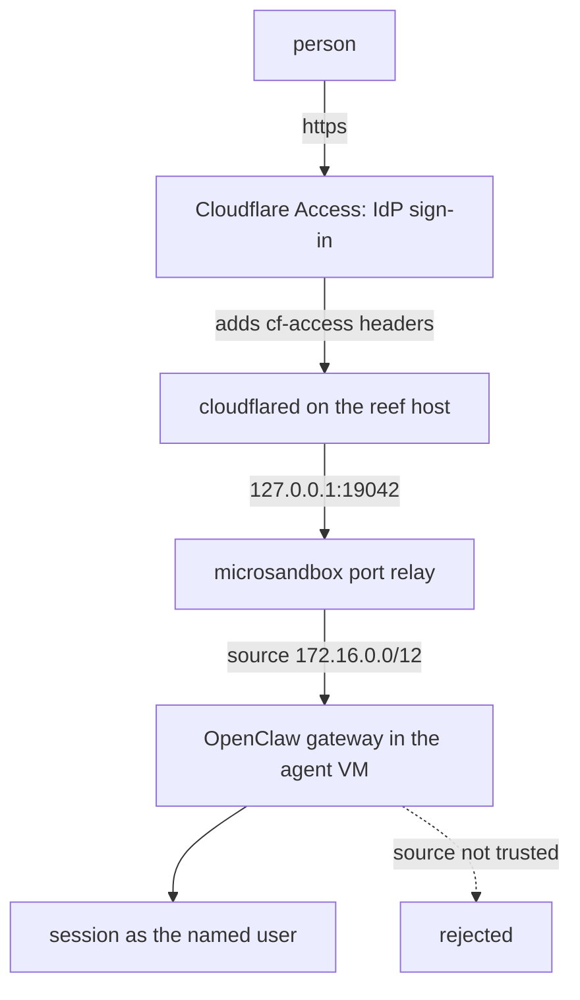

# Cloudflare Access

Put a shared agent behind the org's SSO. No inbound port, no public IP:
`cloudflared` runs on the reef host and dials out, Access authenticates every
request, and OpenClaw reads the identity Access injects.

One tunnel serves the fleet. Each agent gets a hostname, and the Access policy
on that hostname is who may use that agent.



## The one thing to get right

**Identity is a header, not a signature.** OpenClaw does not verify the Access
JWT. It admits a request when three things hold: the source address is in
`gateway.trustedProxies`, the configured headers are present, and
`X-Forwarded-For` resolves to a non-loopback client.

So the boundary is that **only `cloudflared` can reach the agent's port**. reef
gets you most of the way: published ports bind to host loopback, and a role
with a domain egress list cannot reach the host at all, so one agent cannot
reach another's port. What is left is the host itself, which is why
`cloudflared` gets its own account below.

`trustedProxies` is `172.16.0.0/12` because reef's relay re-injects each
connection with the sandbox gateway as the peer; the guest never sees
`127.0.0.1`. The agent cannot mint an identity through that opening even though
its own address is inside the range: OpenClaw rejects any peer that matches one
of the guest's own interfaces.

## Set up

Get the role right **before** first boot. `[files]` seeds the config only when
it is absent, and that path is on the volume, so editing the role later changes
nothing. Re-seeding means `reef agent rm` plus `msb volume rm`.

**1. The agent.** Edit
[`roles/openclaw-marketing.toml`](../../roles/openclaw-marketing.toml): replace
`agents.example.com` with your hostname and the placeholder egress domains with
your own.

```sh
reef role apply roles/openclaw-marketing.toml
reef agent create --role openclaw-marketing --name marketing --owner marketing
reef agent get marketing
```

Note the `ports` line. That port is allocated once and kept for the agent's
life, so it is safe to name in the tunnel config.

**2. The tunnel.** Needs your Cloudflare account; `tunnel login` opens a
browser against your zone.

```sh
cloudflared tunnel login
cloudflared tunnel create reef-agents
cloudflared tunnel route dns reef-agents marketing.agents.example.com
```

Config, one ingress rule per agent:

```yaml
tunnel: <uuid>
credentials-file: /etc/cloudflared/<uuid>.json
ingress:
  - hostname: marketing.agents.example.com
    service: http://127.0.0.1:19042
  - service: http_status:404
```

The catch-all `404` matters: without it an unmatched hostname falls through to
an agent. Run `cloudflared` as its own unprivileged account, whose only reason
to exist is being the one thing that can reach that port.

**3. Access.** In Zero Trust > Access > Applications, add a self-hosted
application for the hostname with one Allow policy naming the people or the IdP
group. Leave one-time PIN off the provider list if the point is to prove SSO.

## Verify

Who got in, read from the agent. `--source system` is required, or this greps
reef's own exec output and silently matches nothing:

```sh
msb logs reef-marketing --source system | grep 'trusted-proxy browser device auto-approved'
```

The line names the identity OpenClaw authorized. It is written once per browser
device, when that device is first approved, so a later quiet session is normal.
If you instead see `device pairing auto-approved device=… role=…`, trusted-proxy
supplied no identity and something else admitted the connection.

That nothing gets in without Access, from any machine:

```sh
curl -sS -o /dev/null -w '%{http_code}\n' https://marketing.agents.example.com/
```

Expect a non-200: a redirect to the Access login, or a `401` for a non-browser
client. A `200` means the request reached the agent with Access not in front of
it.

## Notes

- **No `OPENCLAW_GATEWAY_TOKEN`.** trusted-proxy and token auth are mutually
  exclusive; setting both is a startup error. The fleet entries carry no token,
  unlike the single-user [openclaw](/docs/agents/openclaw) role.
- **`deviceAutoApprove`** saves each person a device approval after they have
  already passed SSO. Never put `operator.admin` in its scopes.
- **`allowedOrigins` must name the public hostname.** Without it the gateway
  still starts, having seeded loopback origins, and then rejects every browser
  request with `origin not allowed`.
- **`browser.extraArgs`** is there because the role declares a secret, and one
  secret turns on TLS interception for port 443 across the VM. Drop it only
  from a role that never opens a browser.
- **`allowUsers` is deliberately absent.** A user list in a seed-once config
  freezes at first boot and silently stops matching your team. Let the Access
  policy be the list.
- **A different proxy changes `userHeader` and `requiredHeaders`** and nothing
  else; `trustedProxies` describes reef's relay, not the proxy. oauth2-proxy
  passes `x-auth-request-email`. Note that the Cloudflare pair also switches on
  OpenClaw's Access identity lookup, which reaches `*.cloudflareaccess.com` and
  `api.github.com` for profile avatars; the roles' egress lists omit those, so
  the lookup simply fails.
- **Browser only.** Access covers every route on the hostname, so the CLI, TUI
  and paired nodes get redirected on the WebSocket upgrade until
  `gateway.remote.edgeAuth` is configured. Out of scope here.
- **Everyone on the agent shares its state**: one session list, one workspace,
  one credential pool, one cookie jar. See
  [enterprise OpenClaw](/docs/enterprise/openclaw) for when to split.
