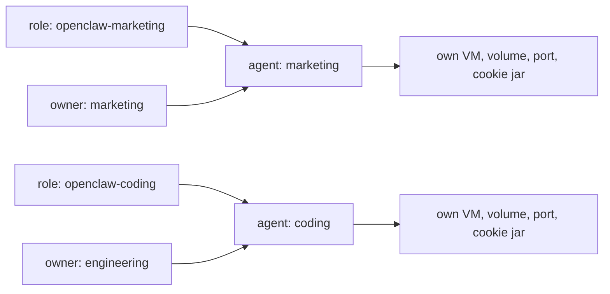

# Enterprise OpenClaw

Purpose-built agents a team shares, behind the org's SSO. Where the
[single-user role](/docs/agents/openclaw) optimises for a first run on a
laptop, these optimise for review: one role file per purpose, each with its own
egress list and its own provider credential.

The roles are skeletons. The shape and the auth wiring are settled; the domain
lists and hostnames are placeholders.

This is one shape, not the shape. Two agents split by purpose is what these files
demonstrate, but the axes below are the point: split by whatever your org already
splits by, and give each split its own role, its own egress list and its own
credential. The host itself is [prepare a host](/docs/setup/host).

## Two axes

A fleet file is a matrix. The **role** is the blast radius: image, egress,
secrets, resources. The **owner** is who may open a terminal into it. They move
independently, and an owner change never touches the VM: it is an edit to the
agent's fleet entry, applied by `reef fleet apply`.



```toml
[agents.marketing]
role = "openclaw-marketing"
owner = "marketing"
```

**Share an agent when the people sharing it are one trust domain.** As these
roles ship, a shared gateway has no per-person separation: one session list, one
workspace, one credential pool, one browser cookie jar. Each person still gets a
durable identity from the email Access supplies, which is what names them in the
session log and on the sessions they create. Upstream is explicit that one gateway
is one trusted operator domain. When the people are not in one trust domain,
give each their own agent instead; they cost one role file between them.

Both roles pin `tools.sessions.visibility = "agent"`, the default since
2026.8.2: any session on the agent reads any other. `tree` or `self` narrows
it, but neither separates the shared workspace or credential pool.

## Group ownership

`owner` is matched against the principals on the caller's SSH certificate, so
it does not have to be a person. Issue team certificates with the group
principal alongside the person's own:

```sh
ssh-keygen -s ca -I ana -n ana,marketing -V +8h ~/.ssh/id_ed25519.pub
```

Everyone on the team can then open the agent. See
[remote access](/docs/enterprise/access) for the full pattern.

## Egress and spend

Each role names only what its purpose needs, which is what a reviewer reads:

| role | reaches |
| --- | --- |
| `openclaw-marketing` | the provider, plus the marketing stack and its asset hosts |
| `openclaw-coding` | the provider, plus code hosting, its API, and the package registry |

Each also names its own secret, so the two purposes hold different provider
keys and the bills separate by purpose. The value is substituted host-side and
never enters the guest.

## Getting in

Terminal access is [remote access](/docs/enterprise/access): SSH certificates,
no new accounts.

Browser access needs an identity-aware proxy in front of the published port.
[Cloudflare Access](/docs/enterprise/cloudflare-access) is the worked example;
for a different proxy, `userHeader` names the header that carries the identity.

The role files carry the policy, never the people. Who may reach an agent is the
Access policy on its hostname, who may open a terminal is the agent's `owner`,
and what either can do once inside is
[who can do what](/docs/enterprise/operators).
