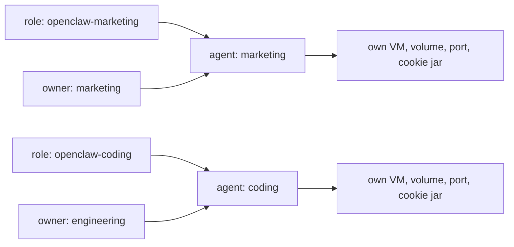

# Set up a team

Purpose-built agents a team shares, behind the org's SSO. Where the
[single-user role](/docs/agents/openclaw) optimises for a first run on a laptop,
these optimise for review: one role file per purpose, each with its own egress
list and its own provider credential.

The role files carry the policy, never the people. Who may reach an agent is the
Access policy on its hostname, who may open a terminal is the agent's `owner`,
and what either can do once inside is [scopes](/docs/enterprise/scopes). Three
separate pages, because they are three separate identities.

The roles are skeletons. The shape and the auth wiring are settled; the domain
lists and hostnames are placeholders.

This is one shape, not the shape. Two agents split by purpose is what these
files demonstrate, but the axes below are the point: split by whatever your org
already splits by, and give each split its own role, its own egress list and its
own credential.

## Steps

The whole job, in order. Each step names the page that owns it.

1. [Prepare the host](/docs/setup/host) and install reef and msb on it.
2. Put both provider keys in `secrets.toml`, below. The first `fleet apply`
   fails without them.
3. Put your domains in `roles/openclaw-marketing.toml` and
   `roles/openclaw-coding.toml`, and your hostnames in
   `fleet/openclaw-team.toml`.
4. `reef role apply`, then `reef fleet apply`. Note each agent's published port:
   it is allocated once and kept for the agent's life, which is what makes it
   safe to name in a tunnel config.
5. Create one Access application per hostname, **before any DNS**
   ([browser access](/docs/enterprise/cloudflare-access)).
6. Run the tunnel as its own unprivileged account, one ingress rule per agent.
7. Route DNS, last, once the connector reports registered connections.
8. Verify from off-host that nothing answers without Access.
9. Grant `operator.admin` to the people who need it
   ([scopes](/docs/enterprise/scopes)).
10. Issue SSH certificates to whoever needs a shell
    ([terminal access](/docs/enterprise/terminals)).

Steps 1 to 4 are reef. Steps 5 to 8 are the proxy. Steps 9 and 10 are per
person and can happen whenever.

## Two axes

A fleet file is a matrix. The **role** is the blast radius: image, egress,
secrets, resources. The **owner** is who may open a terminal into it. They move
independently, and an owner change never touches the VM: it is an edit to the
agent's fleet entry, applied by `reef fleet apply`.



```toml
[agents.marketing]
role = "openclaw-marketing"
owner = "marketing"
```

## Share or split

**Share an agent when the people sharing it are one trust domain.** As these
roles ship, a shared gateway pools nearly everything: one session list, one
workspace, one credential pool, one browser cookie jar. Each person still gets a
durable identity from the email Access supplies, which is what names them in the
session log and on the sessions they create. 2026.9.1 hangs two more things off
that identity: a personal skill library, invisible to the others until shared,
and a personal GitHub connection beside the system account. Neither is a trust
boundary. Library ownership governs discovery and management, not tool access,
and the personal connection stops another member using it, not anyone holding
the gateway's OS account. Upstream is explicit that one gateway is one trusted
operator domain. When the people are not in one trust domain, give each their
own agent instead; they cost one role file between them.

Both roles pin `tools.sessions.visibility = "agent"`, the default since
2026.8.2: any session on the agent reads any other. `tree` or `self` narrows
it, but neither separates the shared workspace or credential pool.

## Egress and spend

Each role names only what its purpose needs, which is what a reviewer reads:

| role | reaches |
| --- | --- |
| `openclaw-marketing` | the provider, plus the marketing stack and its asset hosts |
| `openclaw-coding` | the provider, plus code hosting, its API, and the package registry |

Each also names its own secret, so the two purposes hold different provider keys
and the bills separate by purpose. The value is substituted host-side and never
enters the guest.

Both refs have to resolve before the first `fleet apply` or agent creation
fails. In `~/.local/state/reef/secrets.toml`, which must be `chmod 600`:

```toml
[openclaw-marketing]
openrouter = "sk-or-..."

[openclaw-coding]
openrouter = "sk-or-..."
```

Inline values are plaintext at rest. To resolve them from whatever secret store
the org already runs, give the store a `[resolvers]` command instead: reef runs
it at VM create and takes its stdout as the value, so reef holds no credential
for the credential store.

```toml
[resolvers]
openclaw-marketing = "op read 'op://Infra/{name}/credential' -n"
```

## Why these fields are set

The two roles are the same image and the same seeding as the single-user
[OpenClaw](/docs/agents/openclaw) role, shaped for a team. What differs, and
why:

- **`gateway.auth.mode = "trusted-proxy"`**, so org SSO decides who the caller
  is rather than a shared string.
- **No `OPENCLAW_GATEWAY_TOKEN`.** trusted-proxy and token auth are mutually
  exclusive, and `--bind lan` accepts no token under trusted-proxy.
- **`requiredHeaders` is left unset.** Naming `cf-access-jwt-assertion` there,
  next to `cf-access-authenticated-user-email` as the `userHeader`, switches
  OpenClaw onto a Cloudflare Access identity lookup that needs two more egress
  domains and a GitHub-backed Access IdP. The plain email builds the same
  durable user profile with neither.
- **`${OPENCLAW_PUBLIC_HOST}` in `controlUi.allowedOrigins`**, supplied per
  agent from [`fleet/openclaw-team.toml`](../../fleet/openclaw-team.toml). The
  roles carry no site-specific string, and changing a hostname is a fleet apply
  rather than a re-seed.
- **`--ignore-certificate-errors` and `NODE_EXTRA_CA_CERTS`.** Declaring a
  secret turns TLS interception on for the whole VM. Chromium needs the first;
  without the second the gateway's own outbound TLS rejects the interception
  certificate and it refuses to start.
- **`tools.web.search.enabled = false`.** A declared `OPENROUTER_API_KEY` makes
  OpenClaw treat the perplexity web-search provider as configured, and it then
  refuses to start over that plugin, which the image does not bundle.
- **`tools.sessions.visibility` is seeded, not inherited**, because on a gateway
  a team shares it decides whether one member's session can read another's.

The config reaches the agent through `[files]`, which writes
`/etc/openclaw/defaults.json` into the rootfs; the role's `start` script copies
it to the volume only when the copy is absent. So get it right before first
boot: a later role edit reaches neither.

Next: [browser access with Cloudflare](/docs/enterprise/cloudflare-access), the
worked proxy setup.
