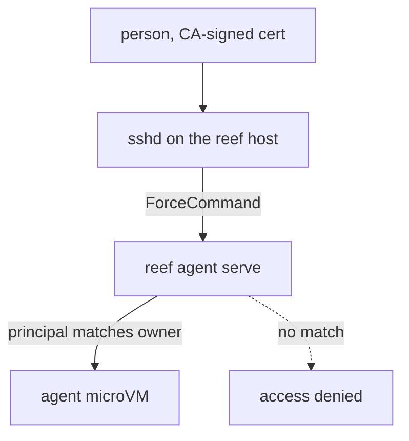

# Terminal access

Give each person a terminal into the agents they own, through the org's
existing SSH identity. reef adds no accounts, keys, or auth of its own: the
org's certificate authority says who you are, OpenSSH enforces what runs, and
`reef agent serve` decides which agents that identity may open.

This assumes a [prepared host](/docs/setup/host), and in particular that the
reef account has a real login shell: sshd's `ForceCommand` runs through it, so
`nologin` breaks everything below.

## How it works



1. The org's SSH CA issues short-lived certificates from the existing SSO
   flow. Its principals are the identities the holder carries: their own
   username, plus any team principals.
2. `ssh hermes-ana.reef` presents the certificate to the reef host, which
   trusts the CA and accepts it on one shared account.
3. sshd never grants a shell and never runs what the client asked for: its
   `ForceCommand` always runs `reef agent serve`, and the requested agent
   name arrives as data in `SSH_ORIGINAL_COMMAND`.
4. serve compares the certificate's principals to the requested agent's
   `owner`, so a certificate opens the agents its holder owns and nothing
   else, and refuses one that is not running.
5. serve answers the session with microsandbox's SSH server, admitting only
   the key the certificate was issued for, and bridges it into the microVM
   over the runtime's own channel. No sshd in the guest, no port at the VM
   boundary, and the role's egress list stays the agent's entire network
   policy.

## Host setup

Everything runs as one Unix account (`reef` below) that owns the reef state
and the sandboxes; the forced command is the only thing a certificate can
run. In `/etc/ssh/sshd_config.d/reef.conf`:

```
Match User reef
  TrustedUserCAKeys /etc/ssh/reef-ca.pub
  AuthorizedPrincipalsFile /etc/ssh/reef-principals
  ExposeAuthInfo yes
  ForceCommand /home/reef/.local/bin/reef agent serve
  DisableForwarding yes
```

`reef-principals` lists one username per line: who may reach the account at
all. `reef agent serve` is the whole authorization step: it reads the
certificate sshd verified, admits the caller only if one of its principals
matches the requested agent's `owner`, refuses an agent that is not running
with a `refused` event, records a `served` event, and serves the session
itself. Give each agent its person at create time:

```sh
reef agent create --role hermes --name hermes-ana --owner ana
```

or with `owner = "ana"` on the agent's fleet entry; omitted, the creating
user is recorded.

sshd's auth log records each authentication with the certificate's key id and
principal, and every session serve opens is a `served` event in `reef events`;
one refused because the agent is not running is a `refused` event.

## Administrators

The forced command applies to every login as `reef`, so an administrator keeps
their own account and reaches the CLI through sudo:

```
ana ALL=(reef) NOPASSWD: /home/reef/.local/bin/reef
```

Then `ssh reef-host sudo -n -u reef -H /home/reef/.local/bin/reef agent list`
works from a laptop, and so does the console:

```sh
reef ui --reef 'sudo -n -u reef -H /home/reef/.local/bin/reef' reef-host
```

Passwordless sudo to the reef binary is the reef account: it can replace the
binary, point `--state` anywhere and exec into every VM, so grant it to
administrators only. sudo's log records who ran what; reef's events do not
record the caller. The `terminal` line the console prints runs `agent ssh` as
`reef`, not as you; the certificate path above is how you open an agent as
yourself.

## Client setup

One block in `~/.ssh/config`:

```
Host *.reef
  User root
  ProxyCommand ssh reef@reef-host.example.com "$(basename %h .reef)"
```

Then `ssh hermes-ana.reef` opens a terminal in the agent, and `sftp` and
`ssh -L` work through it. `scp` copies the file but exits 1, because
microsandbox's SFTP server sends no exit status. Remote (`-R`) forwarding,
agent forwarding and X11 are not implemented at the VM boundary.

The session inside the tunnel authenticates a second time, with the key the
certificate was issued for, so the client needs that private key next to the
certificate: `id_ed25519` beside `id_ed25519-cert.pub`, or both loaded in
ssh-agent. An ssh-agent holding only the certificate is refused.

One host key, `ssh_host_ed25519_key` in the reef state directory, answers for
every agent on the host. It is created on first use and survives role changes
and recreates, so `known_hosts` entries stay valid.

## Certificates

Any issuer the org already runs works - Vault's SSH engine, Smallstep,
Teleport - as long as a principal on the certificate matches the agent's
`owner` and the lifetime is short; expiry is the revocation story. A trial CA
is two commands:

```sh
ssh-keygen -t ed25519 -f ca
ssh-keygen -s ca -I ana -n ana -V +8h ~/.ssh/id_ed25519.pub
```

An owner does not have to be a person. Give an agent `owner = "marketing"` and
issue the team certificates with that principal alongside their own
(`-n ana,marketing`), and everyone on the team can open it. `reef events` then
records a `served` event whose detail is the owner, so the person is in sshd's
auth log rather than reef's.

Install `ca.pub` as `/etc/ssh/reef-ca.pub` on the host and keep the private
half offline.
